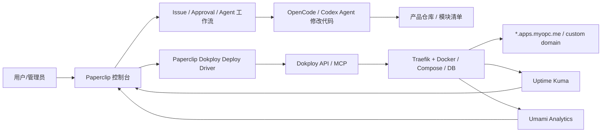

# IOPC / Paperclip × Dokploy 集成方案草案（2026-05-17）

## 当前运行态确认

- `https://myopc.me/` 当前返回 `200`，`http://myopc.me/` 当前返回 `301`。
- 服务器上 `paperclip / nginx / opencode / uptime-kuma / umami / postgresql@16-main` 均为 `active`。
- 当前端口占用：`80/443` 被 nginx 占用，`3000` 被 Umami 占用，`3100` Paperclip，`4096` OpenCode，`3001` Uptime Kuma，`5432` PostgreSQL。

这意味着 Dokploy 不能直接在现服务器无脑安装：官方安装要求 `80/443/3000` 可用，否则安装会失败。建议先采用“独立部署节点”或“维护窗口迁移到 Traefik”的路线。

## 推荐产品形态

把 Paperclip 做成用户/产品控制台，把 Dokploy 做成部署执行层，OpenCode 做成代码改造执行层：



## 多租户映射

- Paperclip `Company` → Dokploy `Organization`
- Paperclip `Project/Product` → Dokploy `Project`
- Paperclip `Environment` → Dokploy `Environment`，至少 `production` / `staging`
- 产品模块 → Dokploy `Application` / `Docker Compose` / `Database`
- Paperclip `Agent` → 运维动作的发起者与审计归属，不直接等同 Dokploy 用户

如果先做 MVP，可以先用“单 Dokploy Organization + 每个 Paperclip Project 对应一个 Dokploy Project”，等租户隔离需求明确后再升级为一公司一组织。

## 二级域名分发策略

建议预留产品域名池，不把所有产品直接挂在根域：

- 主控制台：`myopc.me`、`www.myopc.me`
- 运维后台：`ops.myopc.me` 或 `deploy.myopc.me` 指向 Dokploy
- 产品默认域名：`<product-slug>.apps.myopc.me`
- 多租户推荐：`<project-slug>.<company-slug>.apps.myopc.me`
- 自定义域名：用户配置 CNAME 到 `cname.myopc.me` 或指定网关域名

Cloudflare 已在当前链路中出现。若继续用 Cloudflare 代理：

1. 开发/测试期：先 DNS-only 或手工单域名，减少证书变量。
2. 正式期：为 `*.apps.myopc.me` 做通配 DNS；TLS 可选 Cloudflare Origin Cert 或让 Dokploy/Traefik 为单个域名自动签发。
3. 不建议一开始就让 Agent 自动改 Cloudflare DNS；先让 Paperclip 生成“待配置 DNS 记录”，人工确认后再自动化。

## 模块化部署清单

每个产品仓库增加 `product.deploy.yaml`，Paperclip 读取后决定用 Dokploy Application 还是 Compose：

```yaml
version: 1
product:
  slug: demo-shop
  environments: [staging, production]
modules:
  web:
    type: application
    source: git
    build: dockerfile
    port: 3000
    health: /api/health
    domain: web
  api:
    type: application
    source: git
    build: dockerfile
    port: 8080
    health: /health
  db:
    type: postgres
    plan: shared-small
  stack:
    type: compose
    file: docker-compose.yml
```

## Paperclip 侧建议新增能力

1. Instance 设置：Dokploy URL、API key、默认 serverId、默认 base domain、Cloudflare 模式。
2. Project Deploy 页：显示域名、环境、服务、最近部署、健康检查、回滚入口。
3. Deploy Driver 服务：只暴露白名单动作：create project/env/app/compose/domain、deploy/redeploy、read deployment、rollback。
4. Agent 工作流：开发 → staging 部署 → smoke test → 人工确认 → production 部署。
5. 自动运维：Uptime Kuma 告警或 Umami 异常 → Paperclip 自动建 Issue → Agent 修复 → Dokploy 部署 → 验证后关闭。

## 接入 Dokploy 的两种方式

- 生产控制面：Paperclip 后端直接调 Dokploy REST API，便于权限、审计、幂等和租户隔离。
- Agent 能力面：给 Ops/CEO 级 Agent 配 `@dokploy/mcp`，但普通产品 Agent 不建议拿完整 MCP 权限；普通 Agent 应通过 Paperclip Deploy Driver 走白名单。

## 下一步执行顺序

1. 先完成 `https://myopc.me/` 注册、验证码、登录、Invite、管理员权限浏览器验证。
2. 决定 Dokploy 部署位置：推荐新 VPS/新节点；如果同 VPS，先排维护窗口，因为 `80/443/3000` 冲突。
3. 先配置 `ops.myopc.me` + `*.apps.myopc.me` 的 DNS 策略。
4. 在 Paperclip 增加 Dokploy instance settings 和只读连接测试。
5. 做第一个 MVP：一个 demo repo → Paperclip 项目 → Dokploy project/environment/application/domain → staging URL 可访问。
6. 接入 Uptime Kuma / Umami，把健康和分析回流到 Paperclip Products 页。
7. 再开放自定义域名、多用户权限和自动修复闭环。

## 参考

- Dokploy README: https://github.com/Dokploy/dokploy
- Dokploy Installation: https://docs.dokploy.com/docs/core/installation
- Dokploy Multi-Tenancy: https://docs.dokploy.com/docs/core/multi-tenancy
- Dokploy API: https://docs.dokploy.com/docs/api
- Dokploy Application API: https://docs.dokploy.com/docs/api/reference-application
- Dokploy Compose API: https://docs.dokploy.com/docs/api/reference-compose
- Dokploy Domain API: https://docs.dokploy.com/docs/api/reference-domain
- Dokploy MCP: https://github.com/Dokploy/mcp
